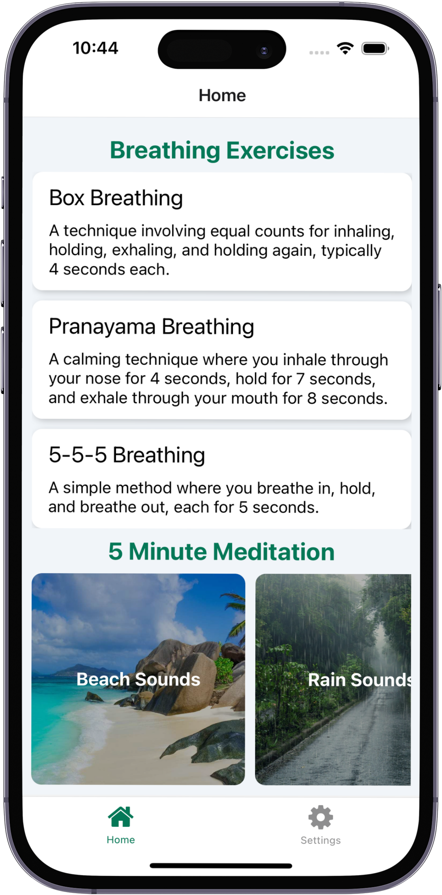
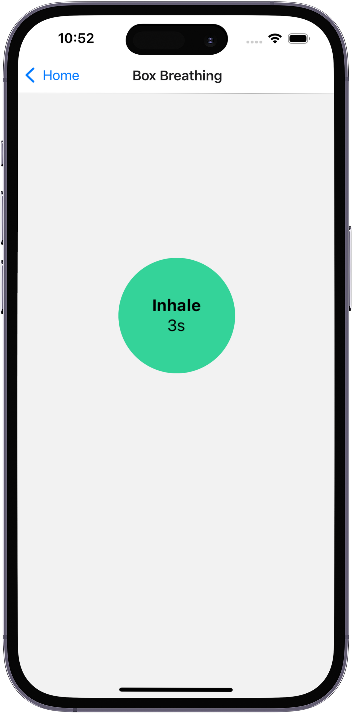

# Breathe Better

## Table of Contents

- [About](#about)
- [Features](#features)
- [Technologies Used](#technologies-used)
- [Screenshots](#screenshots)

## About

Breathe Better is a mobile application designed to promote mental wellness and stress reduction through guided breathing exercises and meditation. The app offers a variety of breathing techniques and short mindfulness sessions, making it easy for users to integrate relaxation practices into their daily routines. Whether you're looking to reduce anxiety, improve focus, or simply take a moment to center yourself, Breathe Better provides the tools you need for a healthier mind and body.

## Features

- **Diverse Breathing Exercises**: Choose from 3 scientifically-backed techniques:
  - Box Breathing: Enhance focus and reduce stress
  - Pranayama Breathing: Promote relaxation and improve sleep
  - 5-5-5 Breathing: Optimize heart rate for overall well-being
- **Guided 5-Minute Meditations**: Quick and effective mindfulness sessions to fit into any schedule. Choose from different immersive sounds: soothing beach waves, gentle rainfall, or calming water fountain
- **Customizable Experience**: Toggle continuous mode to practice breathing exercises indefinitely for an extended session

## Technologies Used

- React Native
- Expo Router
- Context API
- TypeScript

## Screenshots

